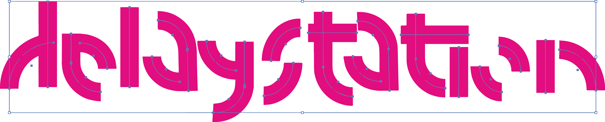

**DelayStation: Games Controller Software & Interface**

--  In order to use the samples included in the repo, copy the Samples folder to Max > Contents > Resources > C74 > media > msp --

-- Drum sample filenames should be in the form "k1"-"k6" .mp3, "s1"-"s6".mp3, "p1"-"p6".mp3, and "h1"- "h6".mp3 (for kicks, snares, percussives and hi-hats respectively) --

-- Currently the patch requires connection of a Sony DualShock 4 controller in order to function --

 [Watch the demo video here!](https://vimeo.com/332750759)

This patch was created in response to a brief focussed on mapping strategies and sonification. It extracts data from a Sony DualShock 4 games controller, and uses that data to manipulate samples and synthesise sounds. It is designed as both a performative tool, and also for recording experimental sounds. Though the software utilises buttons on the controller, its most interesting output is achieved through a combination of subtle and aggressive motion gestures and joystick control.

The patch consists of three main elements: an FM synthesis module, a drum sampler + loop
machine, and another sampling module with effects chain. These elements can be
controlled simultaneously and used to build rich soundscapes and/or musical pieces.

The FM synth captures x-axis gyroscope gestures, rolling through an atonal scale defined by
unstable harmonicity ratios. The sounds produced are different depending on the direction
of rotation. In this way, two modes can be achieved without the use of a button (though
the synth in general is enabled by the circle button). The pitch of the synth can be modulated by an LFO, controlled by continuous data from the L2 button.

The drum sampler uses joystick gestures to trigger one-shot samples that can be replaced by the user. Used with the R2 button and variable delay lines, pitch-shifting effects can be achieved. Achieving this particular effect demands some practice as opposed to more instantly gratifying controls, as the delay lines are defined by the angle by which the joystick rotates before it is released back to the middle. The intention in this respect was to cater to a wide range of users and abilities: the controller and software allow the creation of sound immediately through very simple gestures, but also responds to those that are more precise, and as such promotes a level of virtuosity.

The drum sampler is connected to an automatic looping system, which is continuously filling up and playing back separate buffers as the samples are selected by the D-pad. This adds a crude generative element to the patch, and the user can over-dub drum phrases (or whatever kind of samples are loaded) and scrap them at any time.

The other sampling module is triggered in a similar way to the drum sampler. It is designed for use with longer samples, a random chunk of which is played back when the right joystick is moved to its edge and released to the middle. The system counts how many times the joystick is rotated a full 360°, and modulates the intensity of the phasing pitch effect accordingly. This effect is also altered by X and Y accelerometer data, and a further delay in the effects chain is controlled by the Z-axis gyroscope.

